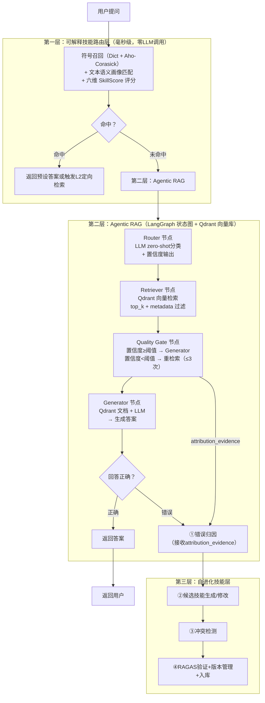
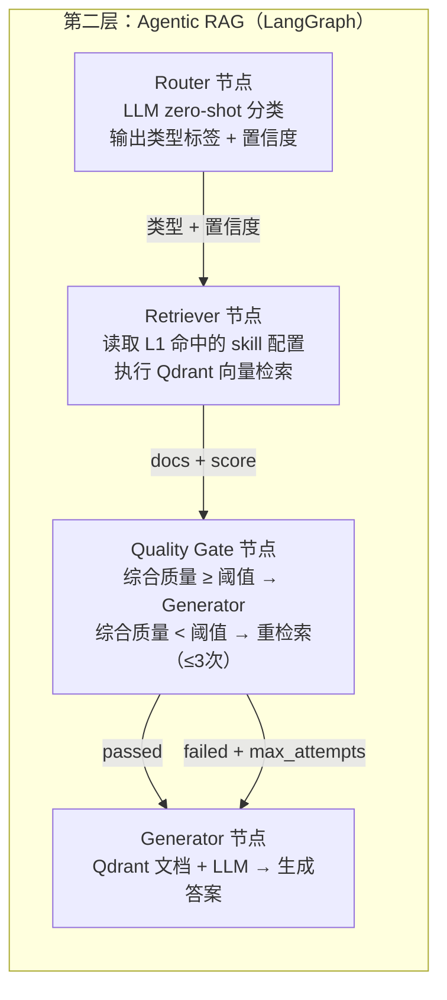
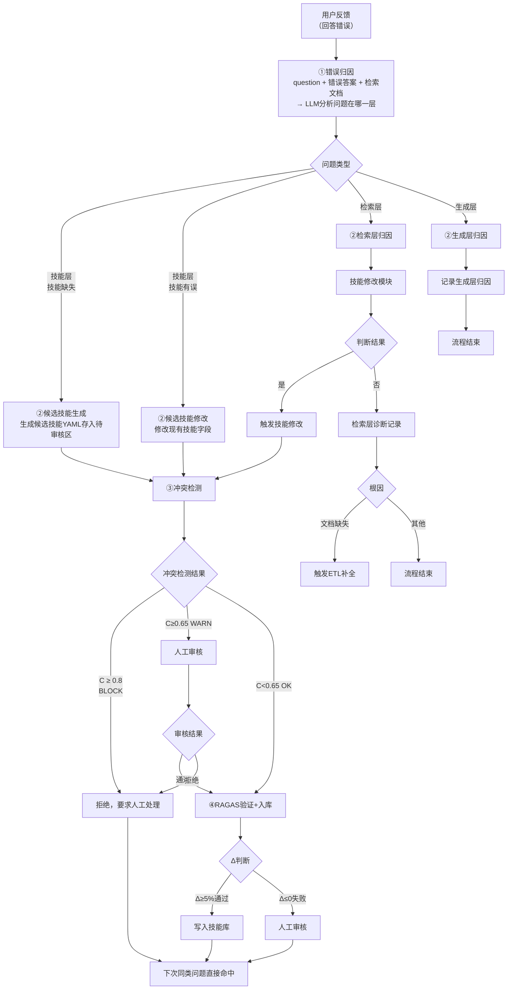

# 第三章 研究内容与技术路线

> **文档版本：** 2026-05-01 第六版（增量：合成反馈通道/归因确定性前置筛/Quality Gate灰色地带/权重学习策略/冷启动验证约束）+ 修订（ScaleRisk五分量/归因两步制/§3.7图更新/P1-2阈值）

## 3.1 研究目标

本项目针对现有校园知识问答系统检索精度不足、无法根据错误反馈动态优化的问题，研究基于"三层分流+可解释技能路由层+分级验证闭环"的 Agentic RAG 系统，实现检索策略的动态决策与技能层的自进化。

**项目一句话定义：** 本项目提出多源错误反馈驱动（真实用户反馈 + RAGAS 合成反馈）、可解释技能路由与分级验证闭环约束下的 Agentic RAG 技能进化框架（EvoRoute-RAG），实现检索策略从静态配置向长期经验积累系统的转变。

**框架开源定义：**

- **框架名：** EvoRoute-RAG
- **一句话定义：** A Feedback-Driven Framework for Evolving Retrieval Strategies in Agentic RAG
- **论文标题：** EvoRoute-RAG: Feedback-Driven Evolution of Retrieval Strategies for Agentic RAG

## 3.2 核心技术架构：三层分流 + 技能自进化闭环

### 3.2.1 整体架构



### 3.2.2 三层分流的设计逻辑

**为什么需要三层而不是一层或两层？**

一层（纯技能）：无法处理复杂语义，技能无法覆盖所有问题类型。

两层（技能 + Agentic RAG）：可以处理简单和复杂问题，但缺少"经验积累"——同类错误下次还会犯。

三层（增加自进化技能层）：错误经过归因、候选技能生成、冲突检测和分级验证后，逐步沉淀为可复用技能。

### 3.2.3 命名规范（重要）

本文中涉及的统一命名：

| 旧名称（已废弃） | 统一名称 | 说明 |
|----------------|---------|------|
| 规则文件 | 技能文件（Skill File） | 存储检索策略的 YAML 文件 |
| 规则库 | 技能库（Skill Library） | 所有技能文件的集合 |
| 规则匹配引擎 | 技能匹配引擎 | 第一层的快速匹配组件 |
| 规则自进化 | 技能自进化 | 第三层的进化机制 |

**注：** 技能文件是核心数据结构；技能库是技能文件的集合；两者共同构成系统的"经验存储器"。

### 3.2.4 attribution_evidence：归因证据而非直接驱动

Quality Gate 在判断检索质量的同时，输出 `attribution_evidence`（归因证据字典），包含关键词命中情况、文档相关性均值、gap类型等，以及 top1_sim（top-1 相似度）、has_correct_entity（检索文档是否包含正确答案关键实体）。**attribution_evidence 是 L3 错误归因的输入证据之一，不是直接驱动技能修改的信号。** 技能修改的触发必须经过完整的 L3 归因流程（①错误归因→②生成/修改→③冲突检测→④分级验证），attribution_evidence 仅作为第一步"检索充分性检查"的输入参数。

---

## 3.3 第一层：可解释技能路由层

### 3.3.1 功能定义

可解释技能路由层是系统的"高速公路"——用确定性算法（Dict + Aho-Corasick）对高频问题进行可解释的六维度评分路由，实现零LLM调用、毫秒级响应。**每一步匹配决策都有可解释的评分依据**，SkillScore六维度让每次路由都有据可查。

**评分公式：**

```
SkillScore = Σ(wi × Di) / Σwi   (i = 1..6)
```

**触发条件：** query 未被 Dict 精确命中，但被 Aho-Corasick 部分匹配。

| 维度 | 变量 | 计算方式 | 权重 |
|------|------|---------|------|
| 关键词命中率 | D_keyword | `len(query_tokens ∩ keywords) / len(keywords)` | 0.25 |
| 模式匹配分数 | D_pattern | Aho-Corasick 加权命中得分（归一化到0~1） | 0.20 |
| 语义类型匹配度 | D_semtype | `1.0` if query_type==semantic_type else `0.5` | 0.20 |
| 同义词扩展覆盖率 | D_alias | `len(query_tokens ∩ aliases) / len(aliases)` | 0.15 |
| 历史成功率 | D_hist | skill.evolution.success_rate | 0.10 |
| 冷启动惩罚 | D_cold | `0.8` if hit_count<10 else `1.0`（乘性系数） | — |

**Phase 1 决策规则：** SkillScore ≥ match_threshold（默认 0.6）→ 命中；SkillScore < match_threshold → 进入 L2。

**Phase 1 不调用 embedding 模型**，同义词扩展通过 `aliases` 字段字符串匹配实现。

### 3.3.3 L1 命中类型

技能匹配引擎命中后，根据 skill 文件的 `answer_type` 字段决定返回方式：

- **`template`（直接返回）**：skill 文件中预置了标准答案，直接返回给用户，**零 LLM 调用，毫秒级响应**
- **`directive`（定向检索指令）**：skill 文件中预置了 L2 检索策略配置（top_k、boost_keywords、filter_metadata），将指令传递给 L2 执行器。**L1 完成零 LLM 路由决策（匹配评分），后续定向检索与生成在 L2 执行**，L2 可能调用 LLM

### 3.3.4 Skill File 结构（semantic_profile 文本形式）

> **Phase 1 核心决策：** Skill File 不含 embedding，`semantic_profile` 使用纯文本字段作为 L1 语义召回的离线匹配文本，无需向量支持。
>
> **Phase 1/2 技能库边界说明（重要）：** Phase 1 技能库封闭——只修改已有技能的字段（boost_keywords、top_k、match_threshold 等），**不新增正式 skill ID**。L3 生成的新技能以"候选技能"形式存入待审核区，经人工审核或 Phase 2 自动升级流程后方可获得正式 skill ID 并入库。

```yaml
# skills/library_overdue_001.yaml

id: library_overdue_001
name: 图书馆借书超期处理
version: 3
created_at: 2026-04-10

trigger:
  keywords: [借书, 超期, 罚款, 归还, 借阅]
  aliases: [借阅图书, 图书归还]        # 同义词扩展，辅助字符串匹配
  semantic_type: procedure_query       # 技术分类，用于L1 D_semtype评分
  question_type: 流程类                # 人类语言学分类，用于申报书叙事

semantic_profile:                       # Phase 1 纯文本，无 embedding
  example_queries:                       # 3-5个典型问法
    - 借书超期了怎么办
    - 图书馆超期罚款标准
    - 图书过期了怎么处罚
  applicable_scenarios:
    - 学生归还图书时发现已超期
    - 查询超期费用和缴纳方式
  response_guidelines: 简洁明了，直接给出处理步骤

match_threshold: 0.6                   # Phase 1 固定

answer_type: template
answer_template: |
  图书馆借书超期处理流程如下：
  1. 登录图书馆官网或微信小程序
  2. 进入"我的借阅"查看超期书籍
  3. 按超期天数缴纳罚款（0.1元/天/本）
  4. 缴纳完成后即可恢复借阅权限

action:
  retrieval:
    boost_keywords: [图书馆借阅规则, 超期处理办法, 罚款标准]
    filter_metadata: {category: library, school_year: current}
    top_k: 5
  generation:
    answer_template: ""
    # Phase 2 扩展字段（接口预留）
    # semantic_embedding: List[float]  # 384维向量

evolution:
  hit_count: 47
  success_rate: 0.94
  false_positive_count: 3
  depends_on: []
  last_evolution_time: "2026-03-15T10:30:00+08:00"
```

| 种子技能 | question_type（主维度） | 服务类别（辅维度） | 覆盖问题示例 |
|---------|----------------------|-----------------|------------|
| 图书馆超期罚款 | 流程指引类 | 图书馆服务 | 借书超期怎么办 |
| 图书馆开放时间 | 事实查询类 | 图书馆服务 | 图书馆几点开门 |
| 奖学金申请时间 | 事实查询类 | 资助服务 | 奖学金什么时候申请 |
| 保研资格条件 | 资格判断类 | 教务服务 | 什么条件能保研 |
| GPA计算规则 | 数值计算类 | 教务服务 | 怎么算GPA |
| 选课补退选流程 | 流程指引类 | 教务服务 | 怎么补选课 |
| 贫困生认定流程 | 流程指引类 | 资助服务 | 怎么申请贫困生 |
| 助学金申请条件 | 资格判断类 | 资助服务 | 谁能申请助学金 |
| 成绩复议流程 | 流程指引类 | 教务服务 | 成绩有问题怎么申诉 |
| 校园卡充值 | 事实查询类 | 后勤服务 | 校园卡怎么充值 |

**分类维度说明：**
- **主维度（问答动作类型）**：资格判断类 / 流程指引类 / 事实查询类 / 政策解读类 / 数值计算类
- **辅维度（服务类别）**：教务服务 / 资助服务 / 图书馆服务 / 后勤服务 / 保卫服务 / 综合办事

#### 3.3.5 技能生命周期管理

技能在系统中经历完整生命周期，各阶段状态、可见性与路由参与权限明确区分：

| 阶段 | 状态标识 | 说明 | 是否参与L1/L2路由 |
|------|---------|------|-----------------|
| **候选** | `candidate` | L3生成的新技能，未入库，仅供模拟验证 | 否 |
| **测试** | `testing` | 通过人工审核，灰度小流量参与路由（Phase 2） | 灰度（Phase 2） |
| **正式** | `active` | 全量参与生产路由 | 是 |
| **休眠** | `dormant` | 连续30天未使用，退出主动匹配，保留元数据 | 否 |
| **淘汰** | `deprecated` | 人工或自动标记，元数据归档，永久退出匹配 | 否 |

> **Phase 1 说明**：Phase 1 技能库封闭，新增技能仅写入候选区，不自动获得正式 skill ID；测试阶段（灰度路由）属于 Phase 2 特性，Phase 1 不实现。


> **Phase 分界：** Phase 1 技能库封闭（只修改已有技能的字段，不新增 skill ID）。Phase 2 才开放新增 skill ID。

---

## 3.4 第二层：Agentic RAG

> **技术选型说明：** 本层基于 **LangGraph**（LangChain 生态）实现，为行业标准做法。
> 向量检索使用 **Qdrant**（生产级向量数据库，支持分布式、实时更新）。
> LLM 调用直接对接 MiniMax API（使用 OpenAI 兼容格式，base_url=https://api.minimaxi.com/v1），直调跳过中间层。
> 
> **这样做的好处：** LangGraph 提供状态图编排能力，Router/Retriever/Generator 均为图节点而非独立服务，流程可控、易于调试。Qdrant 较 Chroma 更适合多校并发场景（Chroma 为嵌入式，更适合 POC）。

### 3.4.1 LangGraph 状态图架构

LangGraph 将第二层实现为有状态有向图，每个节点为可执行函数，边由条件函数控制流转：



### 3.4.2 Router 的置信度输出

Router 节点调用 LLM 做 zero-shot 分类，强制要求输出类型标签和置信度分数：

```json
{
  "类型": "资格类",
  "置信度": 0.76,
  "候选类型": ["资格类", "流程类"]
}
```

**关键设计决策——Router 不做技能匹配，L1 完成匹配后直接进入 L2。** 技能匹配由 L1 层在进入 L2 之前完成（Dict 精确匹配 + Aho-Corasick 多模式匹配），L1 命中的技能 ID 和配置存入 state。Router 只负责对未命中的查询做类型分类，决定 L2 的检索策略倾向。RetrievalNode 读取 L1 命中的 skill 配置（top_k、boost_keywords、filter_metadata）执行向量检索。

> **Router 置信度的用途：** Router 置信度反映"该 query 属于哪类问题"的分类确定性，**不参与 Quality Gate Q 评分**。Q 评分使用检索文档的向量相似度（S/M/A/C）四维指标，与 Router 置信度独立。Router 置信度低于阈值（如 0.5）时，可触发 L2 增加 top_k 搜索——这是 L2 内部的路由策略选择，不是 Quality Gate 决策的一部分。

### 3.4.3 Quality Gate：综合质量门控与重检索

Quality Gate 是 LangGraph 图中的条件节点，综合多维指标决定是否接受检索结果。

**综合质量评分公式：**

```
Q = α·S + β·M + γ·A + δ·C
```

其中：
- **S**（Similarity）：检索文档与查询的向量相似度均值
- **M**（Margin）：top-1 与 top-2 相似度之差，反映答案的明确程度
- **A**（Agreement）：检索文档之间的相关性一致性（向量余弦相似度均值）
- **C**（Coverage）：检索文档对查询关键词实体的覆盖程度（启发式计算，无需 LLM 调用）。提取 query 中的命名实体（人名/时间/地点/机构）和关键名词短语，统计检索文档中包含这些实体的比例

权重建议值：α = 0.40，β = 0.25，γ = 0.20，δ = 0.15。

**⚠️ 权重拍脑袋风险与分阶段解决策略（风险三应对）：** 上述权重是第一期初始建议值，尚未数据支撑。Phase 1 前两周先用单维度硬规则（S ≥ 0.55 且 Q ≥ 0.60 同时满足）启动，同步记录所有四维向量值；积累 100-200 条标注数据后用逻辑回归学习最优权重，A/B 验证后切换。具体见 §3.5.5 权重学习策略。

**门控决策逻辑（含灰色地带，不确定区间）：**

```python
def quality_gate_router(state: AgenticRAGState) -> str:
    S = state["mean_similarity"]
    M = state["top1_margin"]
    A = state["doc_agreement"]
    C = state["coverage_score"]
    Q = 0.40 * S + 0.25 * M + 0.20 * A + 0.15 * C

    # 灰色地带决策（Phase 1 成熟版）
    if Q >= 0.75:
        return "pass"                    # 高置信度，直接通过
    elif Q >= 0.55:
        return "pass_with_log"            # 灰色地带，通过但标记"待验证"
    elif state["reretrieve_count"] < max_attempts:
        return "reretrieve"               # 低置信度，重检索
    else:
        return "pass_with_log"            # 达到最大次数，兜底通过，标记

# 注：pass_with_log 的 case（Q ∈ [0.55, 0.75)）属于"**边界质量区**"——综合质量中等，决策不确定。这类 case 有双重价值：
#   ① 是最有价值的训练数据（Quality Gate 最不确定的决策）
#   ② 优先进入主动探测队列，触发用户反馈采集
```

Quality Gate 的综合质量分数同时用于两个目的：
1. **正向**：决定是否接受当前检索结果，是否需要重检索
2. **输出 attribution_evidence**：作为 L3 错误归因的输入证据之一，用于辅助判断检索是否充分、技能是否相关、文档是否缺失

---

## 3.5 第三层：自进化技能层

### 3.5.1 四步闭环流程



> **Phase 1/2 边界说明：** Phase 1 新增技能仅写入候选区，不自动获得正式 skill ID；已有技能字段修改经审核后可更新正式技能。Phase 2 开放候选技能晋升为正式 skill ID。

### 3.5.2 错误归因：确定性前置筛 + 两步归因法

> **⚠️ 归因利益冲突风险与应对（风险一核心对策）：** LLM 判断"是检索错了还是生成错了"，但 LLM 本身就是生成错误的制造者——存在"让嫌疑人做法官"的利益冲突。本节通过"确定性前置筛"将 LLM 的作用域限制在真正模糊的中间地带（仅占归因请求约 40%），大幅压缩利益冲突空间。详见本节第一步。

**与 Self-RAG 的本质区别：** Self-RAG（Asai et al., 2024, ICLR 2024, Oral top 1%）通过 critique token（ISREL/ISSUP/ISUSE）判断检索文档的相关性、支持度和生成质量，但这些判断仅停留在"评分"层面，不驱动任何系统行为改变。本项目的归因输出映射为候选技能修改动作，并经过冲突检测、分级验证和人工审核后才可能写入技能库——这是从"观察判断"到"有约束的行动"的质变。

**阶段 A：确定性前置筛（零 LLM，毫秒级）**

在调用任何 LLM 之前，先用纯数值指标过滤掉明确 case：

```
归因请求进入
    ↓
top_k_max_sim < 0.45
    → 直接判定：检索层问题（文档在语义层面几乎不相关）
    ↓
top1_sim > 0.80 且检索文档中包含正确答案的关键实体
    → 直接判定：生成层问题（文档足够但 LLM 未用好）
    ↓
介于两者之间
    → 进入 LLM 多裁判投票（真正需要判断的模糊地带）
```

**经验依据**：确定性前置筛通常可覆盖约 50-60% 的归因请求（即 LLM 只需处理剩余约 40% 的模糊 case），归因错误空间大幅缩小。阈值（0.45 / 0.80）Phase 1 冷启动后可根据实际数据微调。

**阶段 A（续）：LLM 多裁判投票**

对确定性前置筛无法判断的模糊 case，使用三个不同 prompt 视角分别归因，取多数票。**attribution_evidence**（含 S/M/A/C 四维分数和 gap 类型）作为多裁判投票的补充证据输入，辅助 LLM 判断"文档是否充分支撑答案"。

```python
def robust_attribution(query, answer, docs, correct_answer):
    prompts = [
        # 视角1：文档充分性（正向问）
        """你是一位系统诊断专家。请判断以下检索到的文档是否足以回答该问题。
        如果文档内容足够支撑正确答案，说明生成层有误；
        如果文档不足以支撑正确答案的关键断言，说明检索层有误。
        输出格式：{"layer": "retrieval" 或 "generation", "reason": "简要说明"}""",
        # 视角2：答案溯源（反向问）
        """正确答案是：{correct_answer}
        请判断：正确答案的关键信息能否在以下检索文档中找到？
        输出格式：{"layer": "retrieval" 或 "generation", "reason": "简要说明"}""",
        # 视角3：断言溯源（对比分析）
        """对比错误答案和检索文档。错误答案中的哪些断言在检索文档中完全没有依据？
        如果存在无依据断言，说明是生成层捏造（检索层OK）；
        如果所有断言都有依据但整体答案仍错，说明生成层理解有偏差。
        输出格式：{"layer": "retrieval" 或 "generation", "reason": "简要说明"}"""
    ]
    votes = [llm_call(p, query, answer, docs) for p in prompts]

    # 多数票逻辑
    vote_results = [v["layer"] for v in votes]
    majority_count = max(Counter(vote_results).values())
    majority_result = Counter(vote_results).most_common(1)[0][0]
    confidence = majority_count / len(votes)  # 1.0=三票一致，0.67=两票一致，0.33=三票全不一致

    if confidence < 0.67:  # 三票全不一致
        return AttributionResult(layer=None, confidence=confidence,
                                 action="human_review", votes=votes)
    return AttributionResult(layer=majority_result, confidence=confidence,
                             action="auto_proceed", votes=votes)
```

**一致性滑动窗口检查：** 若最近 10 次归因中某层占比超过 90%，说明可能存在系统性偏差，系统暂停自动归因并告警。滑动窗口是**稳态保护**（长期趋势异常），与归因失败回退机制（连续3次不同层，瞬态保护）可同时触发，分别独立复位。

**阶段 B：层级归因（LLM 辅助）**

给LLM结构化prompt，判断"仅凭检索到的文档集，能否充分支持当前回答的核心断言"。

归因结果分为两类：
- **检索层问题**：文档不足以支撑回答的关键断言 → 进入阶段B归因
- **生成层问题**：文档足以支撑，但LLM仍生成错误回答 → 仅记录，不触发技能文件更新

**阶段 B（续）：检索层子类型归因**

| 子类型 | 判定标准 | 修复动作 | 是否经过冲突检测 |
|--------|---------|---------|---------------|
| **关键词缺失/不准确** | top_k召回文档中，相关文档向量相似度已较高(>0.75)，但未排在足够靠前位置 | 更新boost关键词列表 | **需要** |
| **精度稀释** | top_k召回了大量低相关性文档(<0.40)，导致相关信息被稀释 | 收紧metadata过滤条件 | **需要** |
| **文档缺失** | 相关文档在top_k中完全缺失 | 触发ETL补全流程（通知管理员，技能层不处理）| **不需要**（ETL是文档侧操作，与技能库无冲突） |
| **技能膨胀（Skill Inflation）** | 技能库规模增长率超过阈值（由 `SKILL_INFLATION_THRESHOLD` 配置，默认 30%）且近期错误率同步上升，疑似技能冲突或注意力稀释 | 触发技能库再平衡流程：聚类合并 + 休眠池加速淘汰 | **不需要**（再平衡是全局操作，不是单技能修改） |

> **冲突检测触发规则：** 检索层归因中，只有"修改现有技能参数"（关键词/精度相关）的 case 才需要经过 §3.5.3 的冲突检测流程。触发 ETL 或技能库再平衡的 case 直接执行对应动作，不经过冲突检测。

### 3.5.3 冲突检测与版本管理

**冲突检测机制：**

综合冲突分数计算：

```
C = 0.4 × Jaccard(depends_on) + 0.3 × Dice(trigger) + 0.3 × Co_occur
```

| 阈值 | 级别 | 动作 |
|------|------|------|
| C ≥ 0.8 | BLOCK | 阻止入库，要求人工处理 |
| C ≥ 0.65 | WARN | 触发人工审核 |
| C < 0.65 | OK | 允许入库 |

**避免"误杀好技能"的安全兜底：**

- 已有技能`hit_count > 100`优先保留（经过验证）
- 新技能价值显著更高（新`hit_count × success_rate` > 旧技能1.5倍）才允许覆盖

**版本管理：**
- 每次技能更新，version字段+1
- 历史版本保留，供快速回滚
- 回滚操作：替换当前版本为上一版本

### 3.5.4 用户反馈信号：第三层进化的触发机制

第一层误匹配是系统的"死区"——若第一层误匹配直接返回错误答案，用户无法纠正，系统永远不会触发第三层进化。

**解法：四通道触发机制（显式通道 + 隐式通道 + 主动探测通道 + 合成反馈通道）。**

**显式通道：** 用户主动标记"没用"按钮，触发进化。意图明确，是最高信度的信号。

**隐式通道：** 基于用户行为日志的统计推断，作为显式通道的补充（信度低于显式）：
- 同一用户或多个用户在 **1 小时内**对相似问题重复提问达到阈值
- 用户点击不同检索结果后仍继续追问
- 会话时长极短（答案立即被放弃）
> 时间窗口约束：隐式信号跨天数过长（如3天前的重复提问）信号意义弱化，须在 **1 小时时间窗口**内累积才视为有效触发。

**主动探测通道：** 针对低置信度答案，以极小概率（1%）在答案末尾主动附加系统探针，在不干扰正常体验的前提下主动收集反馈信号。这是解决"反馈稀疏性"的关键补充——校园场景下学生极少主动点击反馈按钮，主动探测可大幅加速系统认知自身能力边界。

探测内容采用多样性模板，随机选用（如"刚才的答案对你有帮助吗？""你是否在寻找其他相关信息？""这个回答解决了你的问题吗？"），避免重复措辞使用户疲劳。Phase 2 可进一步根据 attribution_evidence 中的 gap 类型动态决定探测内容（如判断为"文档缺失"时，探测内容侧重询问是否需要最新信息）。

用户频率控制：每个用户每天最多触发一次主动探测，防止对同一用户重复打扰，保障用户体验。

**合成反馈通道（第四通道）：** 系统自检而非依赖用户投诉。每周对技能库中每个技能生成 3-5 条对抗性查询，跑完整 L1→L2 流程后用 RAGAS 自动评估；Faithfulness < 0.6 或 Context Precision < 0.5 时自动触发归因，等价于一条系统自检负反馈。这是解决"反馈稀疏性"的核心方案——用户反馈是稀缺资源，系统自检可持续供给。

合成反馈同时解决三个风险：①产生带标签数据验证归因准确率；②为 Quality Gate 权重学习提供训练素材；③归因结果直接改进技能库。

| 信号来源 | 触发进化？ | 数据价值 |
|---------|----------|---------|
| 用户点"没用"（显式） | 立即触发 | 高（真实负反馈） |
| 隐式信号累积达标（1小时窗口） | 触发（需交叉验证） | 中 |
| 主动探测收到负向信号 | 触发 | 中 |
| Quality Gate失败 | 触发诊断候选 | 系统内部置信度低，仅进入L3归因，不自动触发技能修改 |
| **合成反馈（RAGAS 自动评估）** | 触发 | 高（可批量，不依赖用户） |
| 第一层命中+第二层未触发 | 不触发 | 等待四通道之一触发 |
| 主动探测收到负向信号 | 触发诊断候选 | 1%概率探针，有效但稀疏 |
| Quality Gate失败 | 触发诊断候选 | 系统内部置信度低，仅进入L3归因，不自动触发技能修改 |
| 第一层命中+第二层未触发 | 不触发 | 等待四通道之一触发 |

```python
def should_trigger_evolution(reason, implicit_signals=None):
    if reason == "quality_gate_fail":
        return False  # 仅作为诊断候选
    elif reason == "explicit_not_helpful":
        return True
    elif reason == "active_probe_negative":
        return True   # 主动探测负向信号，直接触发
    elif reason == "layer1_match":
        # 隐式通道：1小时内多条交叉验证
        return (
            implicit_signals.get("repeated_queries", 0) >= 3
            and implicit_signals.get("within_1h", False)
        )
    return False
```

**归因失败回退机制：** 若 LLM 归因连续多次结果不一致（如连续 3 次归因到不同层），系统暂停候选技能写入，仅记录异常样本并转入人工审核队列。这一机制防止归因偏差导致的技能库污染，是 L3 进化的必要安全阀。

### 3.5.5 归因准确率验证：Golden Query Set 方案

> **⚠️ 冷启动验证约束（风险一重要防线）：** 在 Phase 1 开放自动归因之前，必须先做离线验证。归因准确率 ≥ 70% 才开放候选技能生成（仍需人工审核，不自动入库）。详见本节冷启动验证流程。

归因准确率是本研究的研究验证目标，而非系统内部自动达到的性能指标。具体方案如下：

**冷启动验证流程（在 Phase 1 开放自动归因前必须执行）：**

```
Step 1: 人工构造 50 条已知根因的错误 case（25 条检索层 + 25 条生成层）
Step 2: 跑一遍完整归因流程（确定性前置筛 + LLM 多裁判投票）
Step 3: 计算准确率

    if 准确率 >= 70%:
        开放候选技能生成（仍需人工审核，不自动入库）
    else:
        调优 prompt 和阈值，重新验证
        （暂不开放自动流程，用人工审核兜底）
```

**三层验证体系：标注一致性 → 归因正确性 → 进化有效性**

**第一层：标注者间一致性（Krippendorff's α）**
- 验证方式：邀请 3 名校园知识服务专家对 150 条典型查询独立标注
- 信度标准：Krippendorff's α ≥ 0.65（≥0.65 说明三位专家结论一致，具有统计可信度）
- [注] **单次归因置信度的缺失**：Krippendorff's α 是群体标注的一致性指标，回答的是"三位专家之间是否一致"，不等于单次归因的置信度。本方案目前无机制量化单次归因的自信程度（如：LLM 输出了 `{"layer": "retrieval", "reason": "keyword_missing"}`，但这个输出本身的置信度是多少？）。这是一个已知缺口，可在后续迭代中加入：例如在归因 prompt 中要求 LLM 同时输出置信度分数（0~1），取多模型投票的多数结果作为归因结论，并计算该结论的置信度。

**第二层：归因正确性（overlap ≥ 0.7）**
- 定义：predicted_skill_id == golden_skill_id 且 overlap ≥ 0.7
- overlap（兼容模式）= |query_tokens ∩ skill_keywords| / |skill_keywords|，衡量 skill 关键词被 query 召回的比例（召回导向）
- overlap（Jaccard 模式）= |intersection| / |union|，同时惩罚 skill 过大导致的假阳性（精确导向，推荐使用）
- [注] **语义相关性缺口**：overlap 验证的是"query 关键词命中了 skill 关键词"，不验证"对应的检索文档是否在语义上能回答该 query"。

**归因反事实分析（Phase 2）**：除了比较 predicted_skill_id 和 golden_skill_id 的 overlap，还可通过归因反事实分析量化归因步骤本身的有效性。具体做法：对于 L3 归因并修改的技能，由专家构造"理想修改方案"（不依赖 LLM，由人工直接给出最合理的 boost_keywords、filter_metadata 等参数），再在后续 RAGAS 测试中对比"L3 自动修改技能"与"专家理想修改技能"的效果差距（Δ_auto vs Δ_expert）。若两者效果接近，说明 L3 归因步骤本身可靠；若 expert 远优于 auto，说明归因本身存在系统性偏差，需要优化归因 prompt 或引入多裁判投票。这一分析直接量化归因模块的贡献度，是本研究的核心验证方法之一。存在关键词命中但文档答非所问的可能（示例：用户问"图书馆几点闭馆"，skill 关键词含"图书馆"，overlap 较高，但 ETL 未入库最新闭馆通知，检索到的文档已过时）。本层 overlap ≥ 0.7 过审后，还需第三层 Δ 验证兜底——若 Δ ≤ 0 说明即便关键词命中，进化后的技能仍未带来实际效果提升，会触发人工审核。
- Δ（进化差值）与归因正确性是**独立指标**：归因正确性验证框架本身的可靠性，Δ 验证技能进化的实际效果

**第三层：进化有效性（Δ > 0）**

验证方式对接行业标准 **RAGAS**（Retrieval-Augmented Generation Assessment，shawnmittal/ragas）评估框架。RAGAS 提供四大指标：
- **Faithfulness**：生成答案对检索文档的忠实度
- **Answer Relevance**：答案对原始问题的相关性
- **Context Precision**：检索上下文的精确度
- **Context Recall**：检索上下文对参考答案的召回率

本项目采用 RAGAS 的 **Context Precision** 和 **Faithfulness** 作为进化验证的核心指标。

Δ = 新技能 RAGAS 分数均值 - 旧技能 RAGAS 分数均值。采用 Bootstrap 法计算 Δ 的 95% 置信区间，仅当置信区间下界 > 0 时视为具有统计显著性。

工程验收阈值：Δ 的 95% 置信区间下界 > 0 且 Δ ≥ 5%（同时满足统计显著性和工程价值）。若 Δ 具有统计显著性但增幅 < 5%，视为工程无效，触发人工审核决定是否采纳。

```python
class AttributionResult:
    CORRECT   = "完全正确"
    PARTIAL   = "部分正确"
    WRONG     = "错误"

def evaluate_attribution(predicted_skill_id, golden_skill_id, query_tokens, skill_keywords):
    if predicted_skill_id == golden_skill_id:
        # 推荐使用 Jaccard 模式（精确导向）
        intersection = len(set(query_tokens) & set(skill_keywords))
        union = len(set(query_tokens) | set(skill_keywords))
        overlap = intersection / union  # Jaccard: 0~1，>0.7 为完全正确，<0.7 为部分正确
        return AttributionResult.CORRECT if overlap >= 0.7 else AttributionResult.PARTIAL
    return AttributionResult.WRONG
```

---

## 3.6 技能库进化效果的可量化追踪

### 3.6.1 进化指标体系

每条技能维护以下量化指标：

| 指标 | 定义 | 用途 |
|------|------|------|
| `hit_count` | 技能被命中的总次数 | 判断技能是否值得保留 |
| `success_rate` | 命中后用户满意的比例 | 判断技能质量 |
| `false_positive_count` | Quality Gate否决次数 | 触发阈值调整 |
| `Δ_score` | 有Skill vs 无Skill的打分差值 | 判断进化是否有效 |

### 3.6.2 技能库动态再平衡机制

**核心问题：技能生成速度若大于技能淘汰速度，技能库必然腐烂（Skill Explosion）。** 长期运行后，技能库会出现：①语义重叠的冗余技能堆积；②早期技能过时但无法自动发现；③新技能与存量技能冲突未被发现。

**ScaleRisk(t) 连续风险指数公式（替换原布尔触发条件）：**

原设计仅定义触发条件（增长率 > 30% 时触发），缺乏连续风险量化能力。新公式将 ScaleRisk(t) 定义为连续风险指数，输出 [0, 1]：

```
ScaleRisk(t) = 0.20·R_scale(t) + 0.25·R_conflict(t) + 0.15·R_new(t) + 0.20·R_error(t) + 0.20·R_synthetic(t)
```

| 分量 | 含义 | 计算公式 |
|------|------|---------|
| R_scale(t) | 规模风险 | `min(skill_count(t) / SKILL_COUNT_MAX, 1.0)` |
| R_conflict(t) | 冲突风险 | `avg_conflict_score(t)`（来自ConflictDetector） |
| R_new(t) | 新增风险 | `new_skill_count_30d / skill_count(t)` |
| R_error(t) | 错误率风险 | `1 - avg(success_rate)` |
| R_synthetic(t) | 合成反馈速率 | `min(synthetic_cases_last_week / 10, 1.0)` |

**合成反馈速率告警：** 当 R_synthetic(t) < 0.1 且真实反馈速率同样极低时，触发告警——系统缺乏进化燃料，技能库将无法持续优化。

**分级验证阈值：**
- ScaleRisk < 0.40 → 低风险：自动记录 + 随机抽检
- ScaleRisk ∈ [0.40, 0.65) → 中风险：RAGAS + 相似 query 回放
- ScaleRisk ≥ 0.65 → 高风险：Golden Query Set + RAGAS + 人工审核

**技能库动态再平衡执行动作（由 ScaleRisk(t) 触发）：**
- **月度聚类压缩**：Phase 1 使用关键词/alias overlap 做粗粒度相似技能发现；Phase 2 使用 embedding 聚类压缩，保留 `hit_count` 更高的
- **休眠池加速淘汰**：连续 30 天未使用且 `hit_count` < 5 的技能自动移入休眠池；`hit_count` >= 5 时人工复核
- **膨胀预警**：ScaleRisk(t) 的 R_scale 分量超过阈值时触发聚类合并

**动态再平衡执行策略：**

| 操作 | 触发条件 | 动作 |
|------|---------|------|
| **月度聚类压缩** | 每月定期执行（Phase 2） | Phase 1 用关键词/alias overlap；Phase 2 用 embedding 聚类压缩 |
| **休眠池加速淘汰** | 连续 30 天未使用（`hit_count` < 5） | 自动移入休眠池，保留元数据但退出主动匹配；`hit_count` >= 5 时人工复核 |
| **膨胀预警** | 月度增长率 > `SKILL_INFLATION_THRESHOLD`（默认 30%）且错误率上升 | 触发技能膨胀归因（§3.5.2 第四类），同步执行聚类合并 |
| **频率衰减** | 长期未使用技能 | `success_rate` 随时间衰减，而非永久保持历史值 |

**淘汰规则：**

```python
if skill_library_scale > scale_threshold and skill.success_rate < 0.5:
    flag_for_review()       # 规模过高 + 成功率低 → 人工审核
elif skill_library_scale > scale_threshold * 1.5 and skill.success_rate < 0.4:
    auto_deprecate()        # 规模严重超标 + 成功率很低 → 自动淘汰
```

---

## 3.7 技术路线总览（attribution_evidence 反馈路径）

```mermaid
flowchart TD
    Query["用户提问"]
    --> L1["第一层：可解释技能路由层"]
    --> L1C{命中？}
    L1C -->|命中| Ans["返回预设答案或触发L2定向检索"]
    L1C -->|未命中| R["Router节点（LLM分类+置信度）"]
    Ans --> End["返回用户"]

    R --> Vec["Retriever节点（Qdrant向量检索）"]
    --> QG["Quality Gate节点"]
QG["Quality Gate节点
Q=α·S+β·M+γ·A+δ·C"]
    QG --> QGd{Q≥0.75?}
    QGd -->|否| QGd2{Q∈[0.55,0.75)?}
    QGd2 -->|是| PWL["pass_with_log
标记待验证"]
    QGd2 -->|否| RR["重检索(≤3次)"]
    QGd -->|否| RR["重检索（最多3次）"]
    RR -.-> QG
    QGd -->|是| Gen["Generator节点"]
    RR -.-> QG
    PWL --> Gen
    Gen --> EndOK["返回用户"]
    Gen --> Gc{用户负向评价？}
    Gc -->|是| EA["①错误归因"]
    Gc -->|否| EndOK["返回用户"]
    QG -.->|attribution_evidence| EA

    EA --> JD{检索充分？}
    JD -->|否| RetRec2["检索层归因"]
    RetRec2 --> RetAct2{根因}
    RetAct2 -->|文档缺失| DocAdd2["触发ETL补全"]
    RetAct2 -->|其他| SK2["候选技能修改"]
    SK2 --> CD["③冲突检测"]
    JD -->|是| RetRec3["生成层归因记录"]
    CD --> CDd{冲突检测结果}
    CDd -->|C ≥ 0.8 → BLOCK| Reject["拒绝，要求人工处理"]
    CDd -->|C ≥ 0.65 → WARN| Review["人工审核"]
    CDd -->|C < 0.65 → OK| VAL["③RAGAS验证"]
    Review --> RevJ2{审核结果}
    RevJ2 -->|通过| VAL
    RevJ2 -->|拒绝| Reject
    Reject --> EndLoop["流程结束"]
    VAL --> Write["④版本管理+入库"]
    Write -.->|新技能/修改入库后| L1
```

---

## 3.8 Phase 1/2 边界与验收标准

### Phase 1 验收标准（必须全部满足）

| 编号 | 标准 | 验证方式 |
|------|------|---------|
| P1-1 | L2 Agentic RAG pipeline 完整运行（Router→Retriever→QualityGate→Generator） | 5条 mock query 端到端跑通 |
| P1-2 | Quality Gate Q ≥ 0.75（mock数据下） | 断言 assert Q >= 0.75 |
| P1-3 | L1 SkillScore 六维度对每条部分匹配 query 均有输出 | 单测验证维度不全则 raise |
| P1-4 | 10个种子技能，覆盖5大服务类别，历史query测试覆盖率≥70% | 人工抽检 |
| P1-5 | 人工审核机制上线（BLOCK/WARN/OK 三档） | 构造高中低三档 case 验证分流 |
| P1-6 | L1 fallback：Dict+Aho-Corasick，零 LLM，响应时间 < 10ms | 性能测试 |
| P1-7 | **模拟进化演示方案可运行**：构造 5-10 条典型错误 case（用户反馈/主动探测触发），展示"归因→候选技能生成→人工审核→入库"的完整闭环 | 答辩/中期检查用，加速验证进化可行性 |

### Phase 2 增量验收标准（Phase 1 满足后才启动）

| 编号 | 标准 |
|------|------|
| P2-1 | L1 升级为语义召回（semantic_embedding 向量索引） |
| P2-2 | ≥1 个技能通过错误反馈成功更新 version |
| P2-3 | L3 分级验证（高/中/低）落地，对应不同验证深度 |
| P2-4 | ScaleRisk(t) 公式落地，输出 [0,1] 风险指数 |
| P2-5 | 多校数据可区分（school_id 过滤） |

> **Phase 分界说明：** Phase 1 不进行全自动技能入库，只进行候选技能生成、候选修改建议和人工审核入库（详见 §3.3.5 技能生命周期）。ScaleRisk(t) 在 Phase 1 可离线计算用于报告和人工审核；Phase 2 才接入自动再平衡流程并开放候选技能晋升为正式 skill ID。

## 3.9 拟解决的关键科学问题

1. **RAG检索决策的可进化表示**：如何用技能文件的形式结构化"某类问题该用什么检索策略"，使其能被LLM生成、被系统存储、可被后续检索复用。

2. **检索层与生成层错误的自动归因**：当回答错误时，如何自动区分是"检索到了错误/不足文档"还是"检索正确但LLM理解偏差"，以确保进化的方向正确。

3. **轻量级技能验证机制的可行性**：在不依赖大规模人工测试集的前提下，分级验证策略（高/中/低风险分类）能否在验证成本和安全性之间取得最优平衡。

4. **归因证据驱动的技能进化稳定性**：attribution_evidence 作为错误归因输入后，进化结果通过 skill 文件 version+1 与 D_hist 被后续路由感知，能否形成稳定的反馈闭环？

---

## 3.10 创新点（压缩为3个参考原则）

> **说明：** 创新点数量不以3为硬性上限，关键看每条是否有实质技术内容支撑。若某条创新点有独立技术贡献，可单独列出。

> **说明：** 本项目的核心创新**不在 RAG 框架本身**——LangGraph + Qdrant 已是行业标准实现。本项目的独特贡献在于**第三层的自进化技能层**，即"如何让 RAG 的检索策略从错误中自动生长和优化"。

**创新点一（核心）：规则引导的技能自进化闭环机制**

现有 Agentic RAG（Self-RAG、SymRAG、RuleRAG）的技能/规则均为离线生成或静态固定，无法从用户反馈中在线生长。本项目提出"错误驱动→归因→技能生成→冲突检测→分级验证→入库"的完整闭环，使技能库随系统使用持续进化，高频且可验证的错误逐步沉淀为技能，LLM 调用随时间递减。这是本项目与 SymRAG/RuleRAG 的**本质区别**。

EvoSkill 的技能进化面向通用任务规划，AgentFactory 的子 Agent 累积面向代码执行，均不涉及 RAG 检索决策的自进化。

**创新点二（架构）：可解释技能路由层（六维度 SkillScore 评分体系）**

现有 Agentic RAG 通常依赖 LLM 或向量相似度进行路由，路由依据难以解释。本项目提出六维度 SkillScore 评分体系（D_keyword + D_pattern + D_semtype + D_alias + D_hist + D_cold），让每次路由决策都有可解释的数值依据。与 Self-RAG 的主要区别：Self-RAG 的 critique token 是即时评分，本项目的 SkillScore 是离线技能评分（判断某类问题该用什么检索策略）。

三层分流架构（零LLM高速→语义RAG→技能进化）的垂直组合在现有工作中未见先例。各层单独均有所研究，但三者的有机组合 + 层间反馈闭环是本项目的原创架构。

**创新点三（方法）：分级验证策略与技能库动态再平衡**

本项目提出 ScaleRisk(t) 连续风险指数驱动的分级验证策略：
- **ScaleRisk(t)** = 0.20·R_scale(t) + 0.25·R_conflict(t) + 0.15·R_new(t) + 0.20·R_error(t) + 0.20·R_synthetic(t)，输出 [0, 1] 连续风险指数
- **三级验证**：低风险（自动记录）、中风险（RAGAS配对验证）、高风险（Golden Query Set + 人工审核）
- **技能库再平衡**：月度聚类压缩 + 休眠池淘汰 + 膨胀预警，防止技能库规模失控（Skill Inflation）

这是从"二元判断（通过/不通过）"到"风险管理"的思维升级，对应 NIST AI Risk Management Framework 的分级安全理念。

---

## 3.11 本章小结

本章提出了基于"三层分流自进化诊断层"的Agentic RAG技术架构：技能匹配引擎（零LLM调用）→ Agentic RAG（深度检索）→ 自进化技能层（将高频且可验证的错误沉淀为可复用检索策略）。

核心机制包括：**归因证据通道**（attribution_evidence → 错误归因 → 候选技能生成 → 冲突检测 → 分级验证 → 入库）、冲突检测与版本管理、冷启动种子技能集、三层分流路由。

本架构与Self-RAG/SymRAG/RuleRAG的本质区别在于：**后者的技能/规则是静态工具，本项目的技能库是活的反馈回路。**
